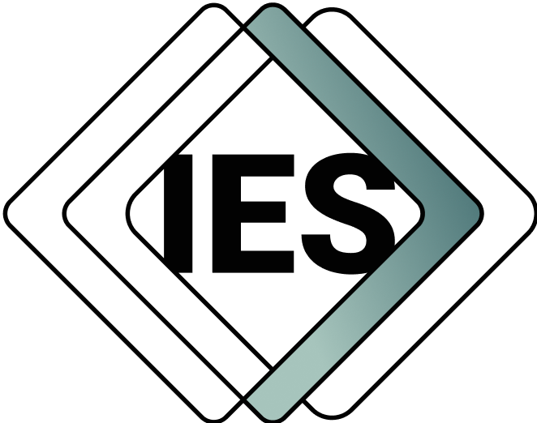

**Repository:** `IES SDNP Possibilia`  
**Description:** `This repository contains the development artifacts for the IES SDNP Possibila ontology module.`  
**Repository Status:** `Private – IES InnerSource`  

## Overview

This repository contains the development artifacts for the IES SDNP Possibilia ontology module. It follows the standard IES ontology development repository structure and incorporates shared IES tools and GitHub workflows.

> **This repository is private and governed by the IES InnerSource License – Version 1.0.**  
> It is intended solely for collaboration among IES-Org teams and authorised suppliers.  
> It is **not open source** and must not be disclosed, redistributed, or published externally.

## Repository Structure

The repository follows the IES standardized structure for ontology development:

* `.github/` - GitHub workflows and issue templates
* `docs/` - Project documentation
  * `assets/` - Documentation assets like images and logos
  * `examples/` - IES examples
  * `specification/` - IES ontology specification
  * `user-guides/` - User guides and tutorials
* `ies_tools/` - Development tools
* `imports/` - Imported ontologies and dependencies

## Licensing

This repository, including all source code, documentation, configuration files, and related materials, is licensed under the:

**IES InnerSource License – Version 1.0**  
See [LICENSE.md](LICENSE.md) for the full license text.

> ⚠️ This repository is **not open source**.  
> Redistribution, disclosure, or publication of any part of this repository is prohibited without the **explicit, written approval** of the IES-Org Management Team.

All intellectual property rights are held by the **Crown**.

### Attribution

When using this ontology, you must include the attribution: © Crown Copyright 2020-2025.

## Acknowledgements  
This repository has benefited from collaboration with various organisations. For a list of acknowledgments, see `ACKNOWLEDGEMENTS.md`.  

### Third Party Components

This project includes third party software and tools under different licenses. See individual dependency documentation for details.

## Changelog

See [CHANGELOG][CHANGELOG] for a list of changes in each release.

## Vulnerability Disclosure

GOV.UK Pay aims to stay secure for everyone. If you are a security researcher and have discovered a security vulnerability in this repository, we appreciate your help in disclosing it to us in a responsible manner. Please refer to our [vulnerability disclosure policy][vul] and our [security.txt][sec] file for details.

[CHANGELOG]: CHANGELOG.md
[docs]: docs/index.md
[sec]: https://vdp.cabinetoffice.gov.uk/.well-known/security.txt
[vul]: https://www.gov.uk/help/report-vulnerability