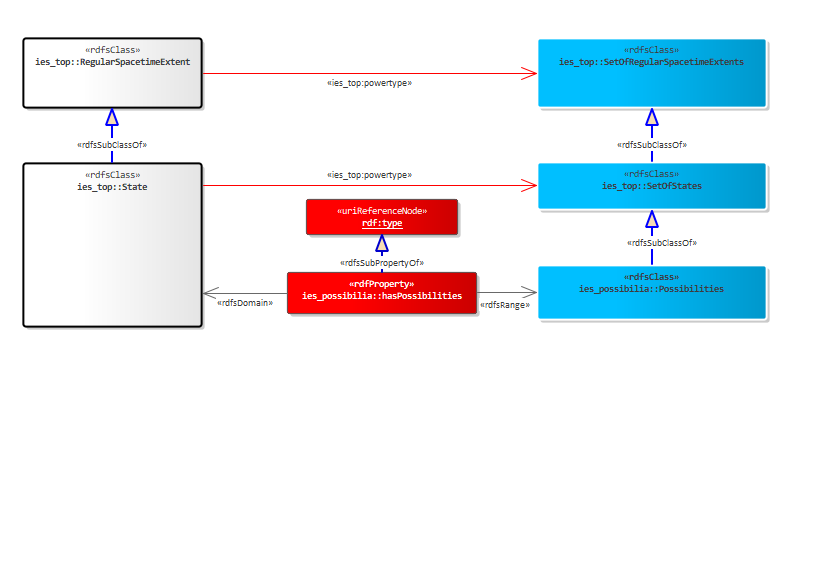
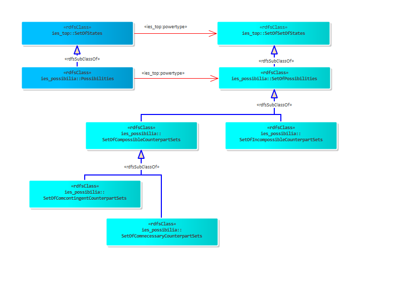
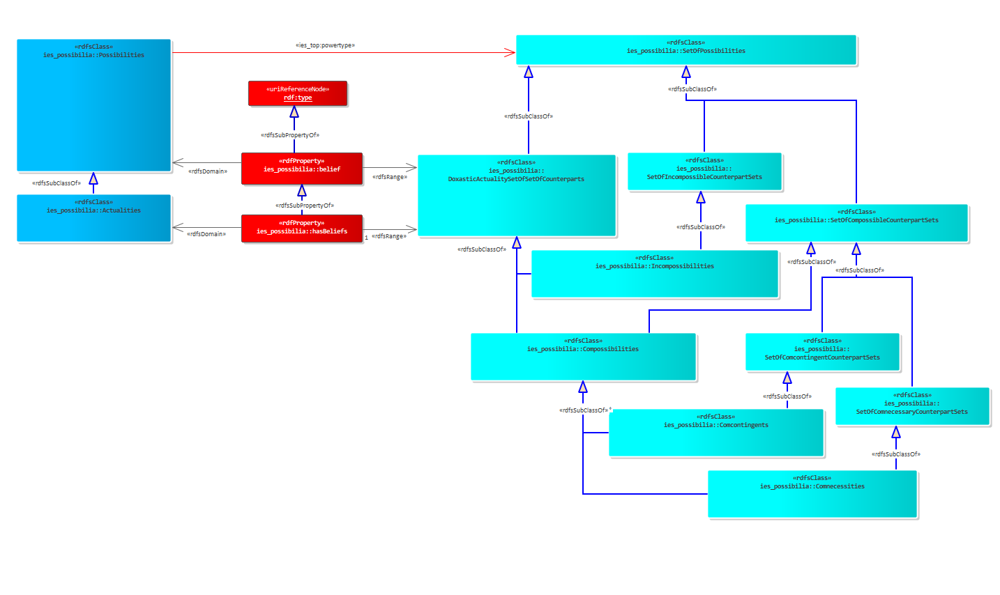
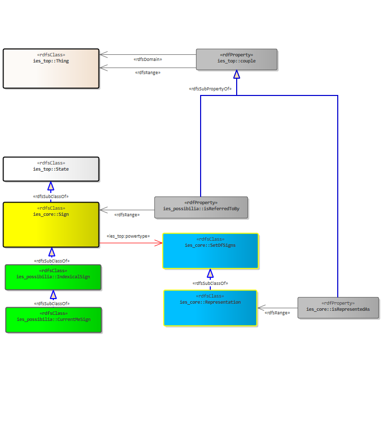

[back to readme](README.md)

Crown Copyright (c) 2026
#  Possibilia

# version: 0.0.1 (DEC 2025 PREVIEW RELEASE)
## Contents
* Introduction Diagrams
    * [Possibilities](#84f941c5-caed-4ce3-a825-2340c3840de9)
    * [Combined Possibilities](#4eb3765c-3d16-45b1-ae4d-06e236aa2900)
    * [Belief](#09fef008-50f8-46ea-af68-ef47bcec10b8)
    * [Me and Now](#7903e7fa-4858-445b-9fea-ce9fa629717e)
* [All Resources](#all-resources)
## Possibilities

### IES elements in this diagram:

* [hasPossibilities](#9b90581e-3ac1-4afa-b52f-955e45f9ba6a)
* [Possibilities](#b630fc83-3fd2-464b-84ef-e0aa80f32b27)
* [RegularSpacetimeExtent](#dcb3f671-0fa3-4de6-b037-a011c432a087)
* [SetOfRegularSpacetimeExtents](#0c4a5ca9-a706-4653-ab55-69d2fcab0d23)
* [SetOfStates](#e25c3b00-4ca3-40f4-9443-15c9dc4ee972)
* [State](#885fc001-7738-47ab-8870-30d004a57180)

Because individuals such as a person, a vehicle, a location and an event are <b><i>States</i></b> (spatiotemporal extents bound to a single universe), discussing possibilities involving them - for example, the possibility of a person called Anne being in Edinburgh at a given time - implies, under the Possible Worlds approach, the existence of two distinct and unconnected extents: a possible Anne who was in Edinburgh and a possible Anne who was not. These must be distinct, since it is impossible to both be and not be in Edinburgh at the same time. And given they are universe-bound, then they must be in different universes.

We therefore need a means to connect these distinct extents across universes. Lewis's answer to this was to connect them using the <i>counterpart</i> <i>relation</i> - an equivalence relation that links individuals who are in some sense, similar. This relation we transform into a set (SetOfCounterparts) containing all counterpart-related extents in the pluriverse. Each set is one counterpart relation and therefore contains as members all extents that are related as counterparts. For example, all the possible ways Anne could have lived her entire life, all the possible Edinburghs, or all the possible states of Anne at a given time.

We could consider this SetOfCounterparts, a set of <i>Possibilities </i>where we can associate members to this set using a special form of rdf:type- which allocates States to this set: the relation,<i> hasPossibilities</i>.

## Combined Possibilities

### IES elements in this diagram:

* [Possibilities](#b630fc83-3fd2-464b-84ef-e0aa80f32b27)
* [SetOfComcontingentCounterpartSets](#57650d5b-2af1-4cbb-a530-23f800503a19)
* [SetOfComnecessaryCounterpartSets](#497c9e4b-175a-4a1d-b2ed-70fd24f05a46)
* [SetOfCompossibleCounterpartSets](#3dc4195a-e020-4294-9eb0-18dc53cfad3c)
* [SetOfIncompossibleCounterpartSets](#4620670e-01bf-40aa-9991-1c8941beb085)
* [SetOfPossibilities](#80e0c4a6-098b-4a71-bca1-c08e47a756ea)
* [SetOfSetOfStates](#44a34647-ea2f-4635-8dd4-9e48008a85af)
* [SetOfStates](#e25c3b00-4ca3-40f4-9443-15c9dc4ee972)

In most cases we do not speak of possibilities in isolation. For example, if Anne was in Edinburgh on the 1st January 2025 - then this possibility involves at least four spatiotemporal extents: 
<ul>
	<li>Anne;</li>
	<li>Edinburgh;</li>
	<li>the period of time - 1st January 2025;</li>
	<li>the temporal part of Anne at Edinburgh on the 1st January 2025.</li>
</ul>
There must be a universe where all four exist together - that is, a universe where they are jointly possible. Consequently, we need a means to talk about <i>combined</i> <i>possibilities. </i>This will become especially important when we turn to the topic of belief (see the section titled <i>Belief</i>).

<i><u>Compossibility</u></i> is a philosophical concept from Gottfried Wilhelm Leibniz which helps us deal with combined possibilities. Leibniz said that a possible world is made up of individuals that are all compossible with one another. He also said that the existence of one individual may negate the possibility of the existence of another i.e. they are incompossible.

We take from Leibniz the concept of Compossibility to introduce a means of grouping <b><i>Possibilities (SetOfCounterparts)</i></b> into sets that are:
<ul>
	<li><b>Compossible</b> - two or more counterpart sets that are jointly possible - there is at least one universe which includes counterparts from each set.</li>
	<li><b>Comcontingent</b> - two or more counterpart sets that are jointly contingent - there is at least one universe, but not all, which includes counterparts from each set.</li>
	<li><b>Comnecessary</b> - two or more counterpart sets that are jointly necessary - all universes include counterparts from each set</li>
	<li><b>Incompossible</b> - two or more counterpart sets that are jointly impossible or incompatible with one another - there are no universes which include counterparts from each set.</li>
</ul>

## Belief

### IES elements in this diagram:

* [Actualities](#967e6d5b-088c-442a-ba83-da617a98c692)
* [belief](#ac27af3f-b7ab-41a2-8b84-606ffa98ba18)
* [Comcontingents](#701c1ca6-2d25-4146-9555-bae553779476)
* [Comnecessities](#06e6d8e8-77cd-454e-b09e-9397381d6980)
* [Compossibilities](#a9418adc-63cc-4bd5-978d-67303074dd4a)
* [DoxasticActualitySetOfSetOfCounterparts](#0fda4305-a22b-4a66-b049-663dfb64b90f)
* [hasBeliefs](#cf7660f3-9634-4315-a22a-5bf8a913fa85)
* [Incompossibilities](#859a6d18-3da3-40eb-85a8-05800cb5a0ee)
* [Possibilities](#b630fc83-3fd2-464b-84ef-e0aa80f32b27)
* [SetOfComcontingentCounterpartSets](#57650d5b-2af1-4cbb-a530-23f800503a19)
* [SetOfComnecessaryCounterpartSets](#497c9e4b-175a-4a1d-b2ed-70fd24f05a46)
* [SetOfCompossibleCounterpartSets](#3dc4195a-e020-4294-9eb0-18dc53cfad3c)
* [SetOfIncompossibleCounterpartSets](#4620670e-01bf-40aa-9991-1c8941beb085)
* [SetOfPossibilities](#80e0c4a6-098b-4a71-bca1-c08e47a756ea)

So far, we have a means of talking about possibilities and combined possibilities, but only from a God-like, agent-agnostic perspective. However, possibilities belong to some thing - they are beliefs held by an agent, whether that is a person, an organization, information in a computer system or even the writings on a piece of paper. Moreover, they belong to an agent <i>at a time</i>, since agents can change their beliefs.

The solution here is to identify the subsets of <i>SetOfCompossibleCounterpartSets </i>which include as one of its members, the possibilities (set of counterparts) of an agent at a time. The goal here is to identify a subset then contains an agent's time-indexed beliefs. For example, when an agent <i>A</i>, at time <i>T</i>, believes in the possibility of <i>X</i>, then there is a compossible set which includes two members:
&nbsp;
<ul>
	<li>The possibilities of agent <i>A</i> at a time <i>T </i>i.e., the set of counterparts of <i>A</i> at <i>T</i>, who hold the same beliefs<i>;</i></li>
	<li>The possibilities of <i>X</i> i.e., the set of counterparts of <i>X</i>.</li>
</ul>

Within this subset of compossibilities, one member remains fixed - the possibilities of an agent at a particular time. In this sense, the subset functions as a structured container for agent-centered beliefs.

David Lewis described these agent-at-a-time-indexed possibilities as "<i>doxastic possibilities</i>". Inspired further by his work, we adopt the term, <i>Doxastic Actualities</i> to refer to the possibilities (counterparts) of the believer at a time. We use these two terms in the RDF structures introduced here (see figure):
<ul>
	<li>We introduce classes to pick-out the compossibilities or incompossibilities that includes (1) the fixed member which is the believer's counterpart set (<i>Actualities</i>) and (2) the n-number of counterpart sets / possibilities that a believer believes.</li>
	<li>To assist with differentiating between the members of these new subsets which is the counterpart set of the believer and the counterpart sets that are beliefs, we introduce two subProperties of rdf:type, belief and <b>hasBelief</b>, to be used respectively for each set-membership relation.</li>
</ul>

## Me and Now

### IES elements in this diagram:

* [couple](#85feafd9-50a0-42ea-9cc7-8dc7b055f47b)
* [CurrentMeSign](#41307dfe-814e-4537-9ae2-8af1a1d9e306)
* [IndexicalSign](#87196942-7c3b-4f81-827f-7ad61c8878b6)
* [isReferredToBy](#ca881bce-a6f8-4a8c-becb-2e69d304c553)
* [isRepresentedAs](#37400026-3e6b-4960-a8e8-832c55ddb10f)
* [Representation](#a4a8f4f5-edc5-48a9-a926-024a25801f5f)
* [SetOfSigns](#4e054f55-b874-4f4d-b5f3-30963d987a3e)
* [Sign](#0600cef2-32e9-4cbd-899a-1319379aebab)
* [State](#885fc001-7738-47ab-8870-30d004a57180)
* [Thing](#27c6bcf1-9ffe-4172-ac2c-e32653b43014)

The possibilities represented by a bearer - whether a database, a digital or physical file, or a written record - may originate from multiple sources. Moreover, these possibilities are not always current; they change over time.

We need a means to give any information bearer the ability to identify both the possibilities <i><u>it</u></i> owns, and which are <i><u>current</u></i> (i.e., the possibilities that are valid <i>now</i>)<b><i>. </i></b>This requires making explicit within the information, two indexicals: "<i>me"</i> - denoting the bearer's self-identity (referred to in philosophy as the <i>de se</i>) and "<i>now"</i> (philosophical termed the <i>de nunc</i>).
<b><i>
</i></b>This is achieved by introducing <i>IndexicalSign </i>which extends Sign. A dedicated subset: <i>CurrentMeSign</i>, is then used to explicitly reference a me's actuality (its counterpart set) using a newly introduced <i>isReferredToBy </i>couple.

## All Resources

### CurrentMeSign
An "I at now" IndexicalSign that self-references a bearer of knowledge within that same knowledge. For example, a sign that points to the spatiotemporal extent of itself within a body of knowledge. In philosophy, this is known as a <i>De Se</i> (Me) and <i>De Nunc </i>(Now) sign.

### hasBeliefs
A type relation that asserts the owner, at a time, of a doxastic SetOfPossibilities.

### Comcontingents
A SetOfComcontingentCounterpartSets indexed to an believer at a time.

### Comnecessities
A SetOfComnecessaryCounterpartSets indexed to an believer at a time.

### Compossibilities
A SetOfCompossibleCounterpartSets indexed to an believer at a time.

### Incompossibilities
A SetOfIncompossibleCounterpartSets indexed to a believer at a time.

### DoxasticActualitySetOfSetOfCounterparts
A doxastic SetOfPossibilities centered to a believer at a time. This includes the believer's time-indexed counterpart set, as well as those that it believes in.

### belief
A type relation asserting that a possibilities set is a member of a set of doxastic beliefs, centered on an believer at a time.

### hasPossibilities
A type relation asserting that a state is a member of a set of similar counterparts or possibilities.

### IndexicalSign
A Sign whose reference depends upon the context of the sign. Examples of such signs include I, Here and Now.

### isReferredToBy
A couple that asserts a sign (single instance of a reference), in someway, refers to a thing.

### Actualities
A SetOfCounterparts which has counterparts of a believer-at-a-time as members.

### SetOfComcontingentCounterpartSets
A SetOfPossibilities that contains possibilities that are jointly contingent; there is at least one universe, but not all, which includes all of those possibilities. In the context of counterparts: there is at least one universe, but not all, which includes a counterpart from each member counterpart set.

### SetOfComnecessaryCounterpartSets
A SetOfPossibilities that contains possibilities that are jointly necessary; all universes include all of those possibilities. In the context of counterparts: all universes include a counterpart from each member counterpart set.

### SetOfCompossibleCounterpartSets
A SetOfPossibilities that contains possibilities that are jointly possible; there is at least one universe which includes all of those possibilities. In the context of counterparts: there is at least one universe which includes a counterpart from each member counterpart set.

### Possibilities
A SetOfStates which has counterparts as members aka. SetOfCounterparts.

### SetOfPossibilities
The powertype of Possibilities (SetOfCounterparts). An instance of this is a set that contains sets of possibilities.

### SetOfIncompossibleCounterpartSets
A SetOfPossibilities that contains possibilities that are jointly impossible or incompatible with one another; there are no universes which include all of those possibilities. In the context of counterparts: there are no universes which include a counterpart from each member counterpart set.

